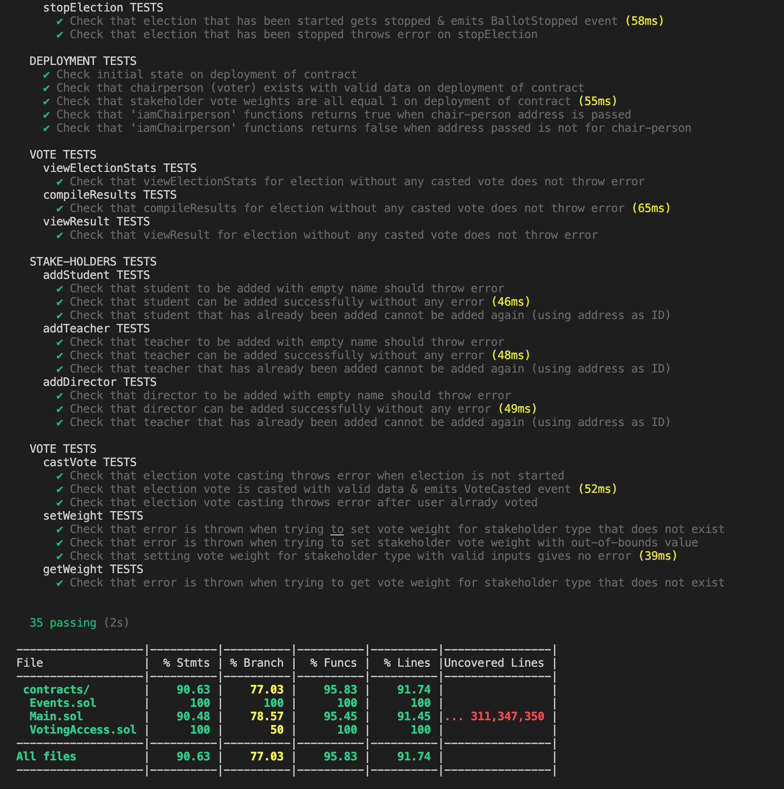

# ZURI-SCHOOL-ELECTION-DAPP
Zuri School Election Dapp (using solidity smart-contract &amp; react for front-end app)

## PROBLEM STATEMENT
```
ZURI as an organisation needs to setup an election for leadership position in its school. The major stakeholders here are the school board of directors, the teachers and the students. Create a smart contract that enables the following:
- Each stakeholders should be able to vote.
- Setup Access control for all stakeholders
- Only the chairman and teachers can setup and compile the result of the votes
- Only the chairman can grant access for the vote to happen.(There should be enable and disable vote.). If vote is disabled, no voting should take place.
- students should not see result of votes until made public by the other stakeholders
```

## SOLUTION
```
Solution is contained in this repository
```

## PROGRAMMING LANGUAGES & TOOLS USED
- Solidity Programming Language (Smart Contract)
- Typescript (Test)
- Javascript (Deployment Script)
- Solidity Coverage + Ganache (Local Testing)

## TEAM MEMBERS
- Asuzu Kosisochukwu Kenny
- Kelechi Fidelis Ndukwe
- Mohammed Dahiru
- Akeju Fatai

## STEPS TO RUN APP
- Clone Github repository
```
git clone {{ GITHUB_REPOSITORY_URL }}
```

- Navigate to project directory
```
cd zuri-school-election-app

For Smart-contract App;

cd zuri-school-election-app/smart-contract


For Front-end App;

cd zuri-school-election-app/front-end
```

- Install app dependencies
```
npm install
```

- Setup environment variables
```
Check sample.env file (SMART-CONTRACT APP)
```

- Start Application
```
For Smart-contract App;
- npm run deploy
- npm run verify

For Front-end App;
- npm start
```

- Testing
```
npm test
npm test:coverage (SMART-CONTRACT)
```


